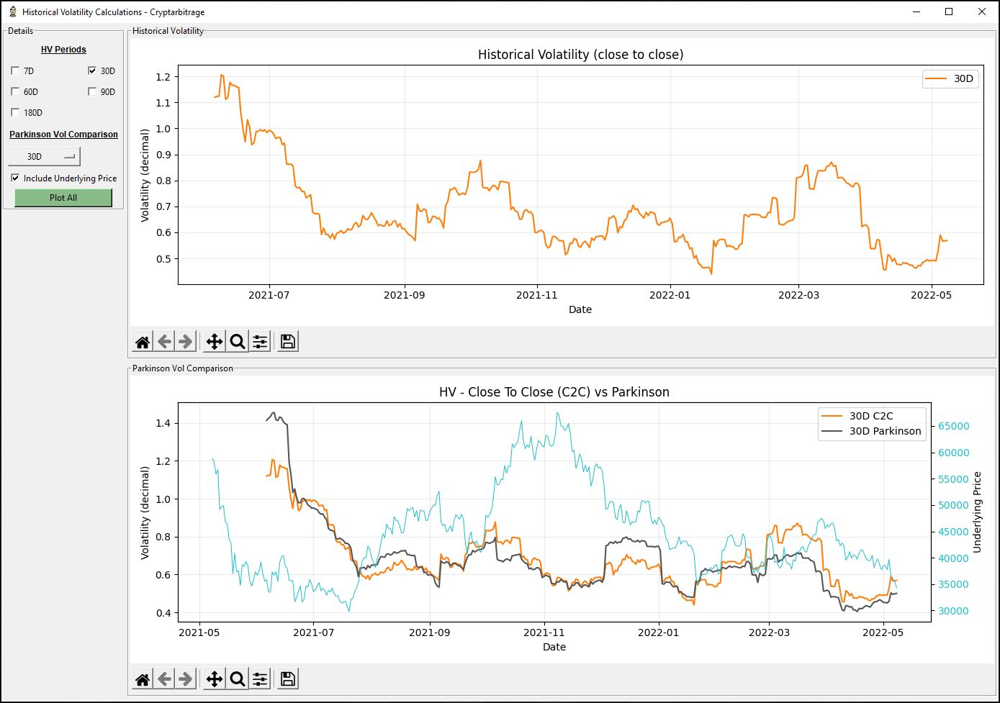
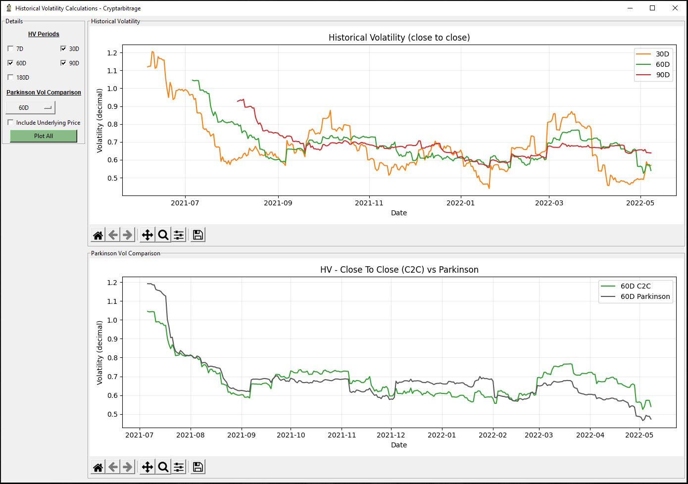

# Historical Volatility Calculations
Python code that uses historical price data to calculate and display historical volatility (close to close and Parkinson).

The first chart shows the historical volatility, calculated over various periods, using the close to close method.
The second chart compares the volatility using the close to close and Parkinson methods. It does this for a single selected period.
It is also possible to overlay the underlying price on this chart as well.

Go to https://github.com/cryptarbitrage-code/historical-volatility-calculations for the latest code.

Follow me on https://twitter.com/cryptarbitrage for other free resources and content.

Deribit ref-link: https://www.deribit.com/?reg=1332.557&q=home (10% discount on trading fees)

## GUI and Charts
Tkinter is used for the GUI, and Matplotlib is used to plot the charts.

## Pricing data formats
This program was designed using csv files that contain daily price data from yahoo finance, like the ones that can be downloaded here for example: https://finance.yahoo.com/quote/BTC-USD/history/

As dataframes are used, any csv that has the same column headings should work. The column headings used are: High, Low, Open, Close